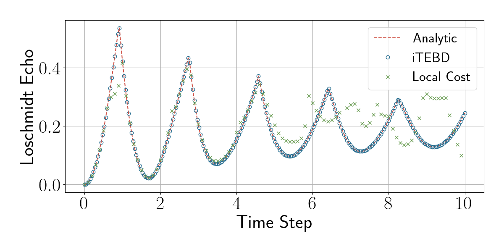

# qdmt
Quantum Density Matrix Truncation

This code is a mess, my bad.

## Quick Start
I recommend using [`poetry`](https://python-poetry.org/) to setup the environment and required packages.

A good place to start is the scripts folder which has code to run DMT on

To run the time evolution have a look a `scripts/evolve_experiment.py`. This script

1) Initialises all the evolution hyperparameters.
2) Prepare the groundstate of a TFIM using VUMPS.
3) Initialise logging.
4) Run the time evolution using the dmt algorithm, saving the iMPS tensor at each step.

To analyse the output from this time evolution see `scripts/evolve_analyse.py`. It basically just calculates the Loschmidt echo at each time step from the iMPS tensors found using iTEBD (see `qdmt/tenpy-test.py`) and the DMT algorithm. Then plots both on the exact loschmidt curve.

The output from this analysis looks like:

